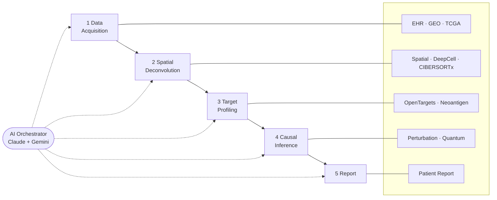

# Precision Medicine MCP Platform

[](https://www.python.org/downloads/)
[](https://github.com/jlowin/fastmcp)
[](https://modelcontextprotocol.io/)
[](LICENSE)


> **Dedicated to PatientOne** -- a dear friend who passed from High-Grade Serous Ovarian Carcinoma in 2025.

---

## The Problem

Standard HGSOC workup (BRCA1/2, HRD panel, CT imaging) generates **no immunotherapy hypotheses**. Manual multi-modal analysis across genomics, spatial transcriptomics, imaging, and clinical data takes an estimated 40 hours and $6,000-9,000 per patient -- making integrated analysis clinically impractical.

## The Platform

A 19-server MCP architecture orchestrated by AI (Claude + Gemini) executes a 5-stage pipeline:



### Architecture at a glance

```
                  +--------------------------------------+
                  |           CLIENT LAYER               |
                  |  Claude Desktop / Hospital EHR       |
                  |  Adapter / Research Notebook         |
                  +----------------+-----------------+
                                   |
                         MCP (FastMCP >= 2.13)
                                   |
   +---------------------------------------------------------------+
   |                                                               |
   |  DATA ACQUISITION      ANALYSIS & INFERENCE      REPORTING   |
   |                                                               |
   |  mockepic              spatialtools    (16)      patient-     |
   |  epic                  multiomics     (10)       report (5)   |
   |  geodownload           perturbation    (8)                    |
   |  mocktcga              quantum-fidelity(6)                    |
   |  genomic-results       opentargets     (6)                    |
   |  fgbio                 neoantigen      (6)                    |
   |                        cibersortx      (5)                    |
   |  [7 servers]           openimagedata   (5)       [1 server]   |
   |                        deepcell        (3)                    |
   |                        cell-classify   (3)                    |
   |                        cardiometabolic (5)                    |
   |                                                               |
   |                        [11 servers]                           |
   +---------------------------------------------------------------+
                     19 custom servers, 104 tools
```

| | Servers | Tools |
|-|---------|-------|
| **Custom** | 19 servers | 104 tools |
| **External** | 6 connectors (PubMed, bioRxiv, ClinicalTrials.gov, Seqera, cBioPortal, HuggingFace) | 46 tools |

All tools accessible via natural language. Every AI result requires **clinician APPROVE/REVISE/REJECT**. HIPAA-compliant. See [Server Registry](docs/reference/shared/server-registry.md).

## The Results

The platform surfaces clinically actionable findings that standard workup cannot reach — validated across three independent use cases:

| Use Case | Patient | Key Finding Missed by Standard Workup |
|---|---|---|
| **HGSOC (Stage IV)** | PAT001 | 3 investigational paths: neoantigen vaccine (RMPEAAPPV IC50 7.8 nM), NNMT/CAF inhibition, convergent checkpoint blockade |
| **ER+ Breast Cancer** | PAT002 | HRD 35 below myChoice threshold but PARP-eligible via BRCA2 germline — clinically significant nuance, zero code changes |
| **Preventive Cardiovascular** | PAT003 | Intermediate CVD risk (Reynolds 14.3%) with 3 high-priority gaps missed by standard lipid panel AND population genetic screen: Lp(a), APOE genotype, CAC score |

The same 19-server architecture runs all three. No disease-specific code changes between use cases.

### Validated results — PAT001 (HGSOC)

| Metric | Value | Source server |
|--------|-------|---------------|
| HRD score | 72 | mcp-genomic-results |
| TMB | 4.2 mut/Mb | mcp-genomic-results |
| Top neoantigen IC50 (RMPEAAPPV) | 7.8 nM | mcp-neoantigen |
| Spatial spot count | 300 | mcp-spatialtools |
| Moran's I (global) | -0.0033 | mcp-spatialtools |
| Deconvolution: tumor | 56 cells | mcp-cibersortx |
| Deconvolution: endothelial | 44 cells | mcp-cibersortx |
| Deconvolution: macrophages | 43 cells | mcp-cibersortx |
| Deconvolution: fibroblasts | 41 cells | mcp-cibersortx |
| Deconvolution: CD8+ T cells | 30 cells | mcp-cibersortx |

---

## Try It

```bash
# Clone and explore
git clone https://github.com/lynnlangit/precision-medicine-mcp.git
cd precision-medicine-mcp

# Run tests for any server (DRY_RUN mode, no external deps needed)
cd servers/mcp-multiomics && uv run pytest -v

# Or use Claude Code to explore interactively
claude
```

All servers default to **DRY_RUN mode** (mock responses, no API keys needed) for quick validation. Set `*_DRY_RUN=false` to use **synthetic patient data** for end-to-end testing.

---

## Learn More

| Audience | Start Here |
|----------|------------|
| **Getting Started** | [Installation Guide](docs/getting-started/installation.md) |
| **Funders** | [Executive Summary](docs/for-funders/EXECUTIVE_SUMMARY.md) |
| **Hospitals** | [Hospital Guide](docs/for-hospitals/README.md) |
| **Developers** | [Architecture](docs/for-developers/ARCHITECTURE.md) |
| **Researchers** | [Researcher Guide](docs/for-researchers/README.md) |
| **Educators** | [Educator Guide](docs/for-educators/README.md) |
| **All docs** | [Documentation Index](docs/INDEX.md) |

**Video:** [5-minute demo](https://www.youtube.com/watch?v=LUldOHHX5Yo) | **Paper:** [Why MCP for Healthcare](docs/reference/architecture/WHY_MCP_FOR_HEALTHCARE.md) | **External connectors:** [Setup guide](docs/for-researchers/CONNECT_EXTERNAL_MCP.md)

---

## Known limitations

- **DRY_RUN mode returns synthetic data** — not for clinical decisions. Set `*_DRY_RUN=false` with real data for validated results.
- **GEARS model trained on synthetic GSE184880 subset** — retrain on real TCGA data before clinical use.
- **Quantum server falls back to CPU** on non-CUDA hardware (Apple Silicon, cloud VMs without GPU). Results are identical; training is slower.

---

**Apache 2.0** | **Python 3.11+** | **FastMCP >= 2.13** | **uv** for package management
