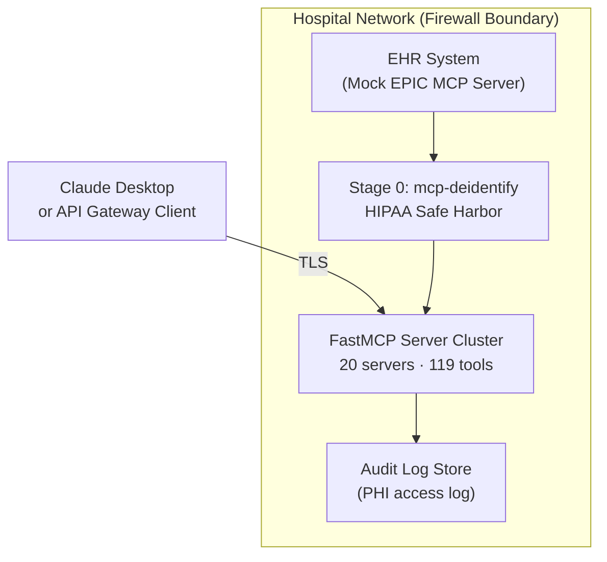

# Deployment Architecture

## System Overview

## Minimum viable deployment (5 servers)
For a basic genomic + neoantigen workflow, only these five servers are required:
1. **genomic-results** -- HRD and TMB calculation
2. **neoantigen** -- MHC-I/II binding prediction
3. **spatial-tools** -- spatial transcriptomics analysis
4. **cell-classify** -- cell type deconvolution
5. **patient-report** -- structured report generation

## Data flow
1. Pathologist uploads tumor biopsy FASTQ or h5ad to the de-identification layer.
2. De-identification layer strips PHI and assigns a study ID.
3. `genomic-results` runs `parse_somatic_variants` and `calculate_hr_deficiency_score`.
4. `neoantigen` runs `predict_mhc1_binding` on candidate peptides.
5. `spatial-tools` runs `get_spatial_data_for_patient` and `calculate_spatial_autocorrelation`.
6. `cell-classify` runs `classify_cell_states`.
7. `patient-report` runs `generate_patient_report` assembling all outputs.
8. Oncologist receives the structured report via the API gateway client.

## On-premise vs cloud-hosted

| Component | On-prem required? | Reason |
|-----------|-------------------|--------|
| De-identification layer | Yes | PHI must not leave hospital network unmasked |
| GEARS model weights | Yes (recommended) | Proximity to PHI data |
| Quantum server | Yes (recommended) | Research prototype; not validated for cloud latency |
| FastMCP server cluster (all 20) | Yes | Co-locate with patient data |
| Claude API gateway | Cloud | Anthropic-hosted; only de-identified data flows here |
| Audit log store | Yes | HIPAA audit requirement; must be tamper-evident |
