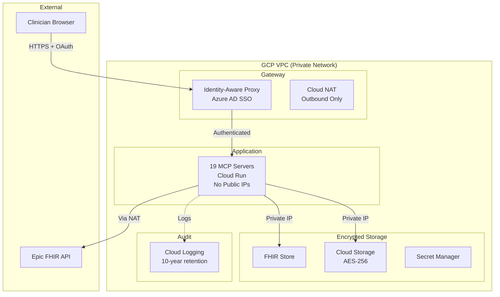

# Security Overview

One-page security architecture summary for hospital IT and security officers.
See [HIPAA Summary](../reference/shared/hipaa-summary.md) for compliance overview.

---

## Architecture

---

## Security Controls

| Area | Control | HIPAA Section |
|------|---------|---------------|
| **Network** | VPC isolation, no public IPs, Cloud NAT outbound only, TLS 1.3 | 164.312(a)(1), (e)(1) |
| **Auth** | Azure AD SSO, MFA required, RBAC (clinician/bioinformatician/admin), 30-min idle timeout | 164.312(d), 164.308(a)(4) |
| **Encryption** | AES-256 at rest (Cloud Storage, FHIR Store), TLS 1.3 in transit, GCP Secret Manager | 164.312(a)(2)(iv), (e)(2) |
| **Audit** | 10-year immutable Cloud Logging + FHIR AuditEvent, all API calls logged | 164.312(b), 164.316(b)(2) |
| **De-ID** | HIPAA Safe Harbor (all 18 identifiers removed) — mcp-epic for FHIR/EHR data; mcp-deidentify (Stage 0) for clinical documents, genomics files; three-layer validation (Haiku red-team + regex + key lookup) | 164.514(b)(2) |
| **Incident** | 60-day breach notification, documented response procedures | 164.408 |

---

## Access Control Matrix

| Role | FHIR Data | Genomic Data | Analysis Results | Admin |
|------|-----------|--------------|------------------|-------|
| Clinician | Read (de-identified) | Read | Read/Write (own) | None |
| Bioinformatician | Read (de-identified) | Read/Write | Read/Write (all) | None |
| Admin | Audit logs only | None | Audit logs only | Full |

---

## Incident Severity

| Level | Response | Example |
|-------|----------|---------|
| **Critical** | 1 hour | PHI exposure, system down |
| **High** | 4 hours | Failed de-identification, unauthorized access |
| **Medium** | 1 business day | Slow queries, minor data errors |
| **Low** | 3 business days | Enhancement requests |

---

## AI Result Transparency

Every MCP tool returns structured `xai_metadata` alongside its results, providing clinicians with evidence traceability for each AI-generated recommendation.

**Key fields visible to clinicians:**

- **Confidence level** (`high` / `medium` / `low`) -- overall reliability of the result
- **Key drivers** -- the 1-3 factors that most influenced the result (e.g., "TP53 mutation detected", "gnomAD allele frequency < 0.01%")
- **Evidence grade** -- domain-specific strength rating (e.g., AMP Tier I for genomic variants, AHA guideline-based for cardiovascular risk)
- **Counterfactual** -- what would change the result (e.g., "If BRCA1 were wild-type, PARP inhibitor would not be recommended")

**Clinician decision support:** The patient report aggregates evidence from all tool calls into an `evidence_strength_summary` showing high/medium/low confidence counts and the weakest evidence link. This enables informed APPROVE / REVISE / REJECT decisions per the clinician-in-the-loop workflow.

**Audit trail:** All `xai_metadata` is captured in Cloud Logging alongside tool call parameters and results, retained for 10 years per HIPAA audit requirements.

**Schema reference:** [XAI Metadata Schema](../reference/shared/xai-metadata-schema.md)

---

**See also:** [compliance/hipaa.md](compliance/hipaa.md) | [HIPAA Summary](../reference/shared/hipaa-summary.md) | [DEPLOYMENT_CHECKLIST.md](DEPLOYMENT_CHECKLIST.md)
