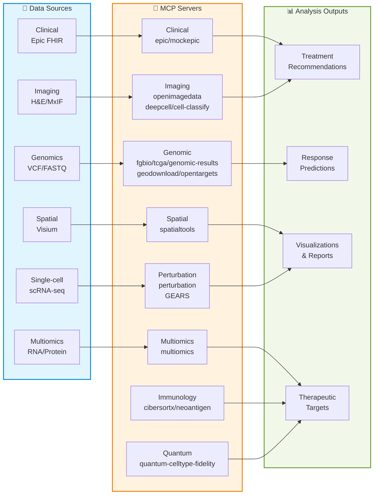
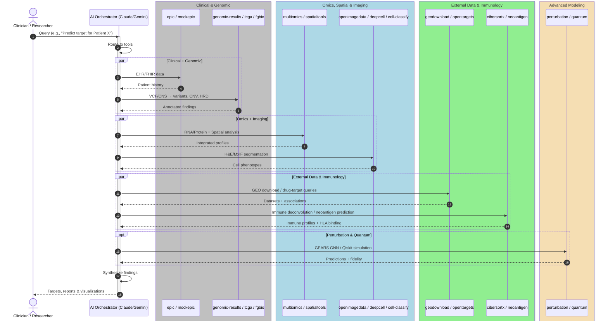

# 🏗️ Precision Medicine MCP Server Architectures

Architecture documentation for the Precision Medicine MCP system, covering both modality-specific workflows and cross-cutting system design.

---

## System Overview

---

## 📊 Architecture by Analysis Modality

13 analysis modalities across multiple specialized servers and tools (see [Server Registry](../shared/server-registry.md)):

| Modality | Servers | Tools | Status | Documentation |
|----------|---------|-------|--------|---------------|
| 🧬 **Clinical Data** | mcp-epic, mcp-mockepic | 7 (4+3) | ✅ Production/Mock | [clinical/ehr-integration.md](clinical/ehr-integration.md) |
| 🧪 **Genomic Cohorts** | mcp-mocktcga | 5 | ❌ Mocked (GDC-ready) | [dna/genomic-cohorts.md](dna/genomic-cohorts.md) |
| 🧬 **Genomic Results** | mcp-genomic-results | 4 | ✅ Production (100%) | [dna/genomic-results.md](dna/genomic-results.md) |
| 🖼️ **Imaging** | mcp-openimagedata, mcp-deepcell, mcp-cell-classify | 11 (5+3+3) | ✅ Production (100%) | [imaging/README.md](imaging/README.md) |
| 🔬 **Multiomics** | mcp-multiomics | 10 | ✅ Production (95%) | [rna/multiomics.md](rna/multiomics.md) |
| 📍 **Spatial Transcriptomics** | mcp-fgbio, mcp-spatialtools | 18 (4+14) | ✅ Production (95%) | [spatial/README.md](spatial/README.md) |
| 🎯 **Perturbation Prediction** | mcp-perturbation | 8 | ✅ Production (GEARS) | [rna/perturbation.md](rna/perturbation.md) |
| ⚛️ **Quantum Cell Type Fidelity** | mcp-quantum-celltype-fidelity | 6 | ✅ Production (Qiskit + Bayesian UQ) | [rna/quantum-fidelity.md](rna/quantum-fidelity.md) |
| 📄 **Patient Reports** | mcp-patient-report | 5 | ✅ Production (100%) | [servers/mcp-patient-report/README.md](../../../servers/mcp-patient-report/README.md) |
| 📥 **External Data** | mcp-geodownload, mcp-opentargets | 12 (6+6) | ✅ Production (100%) | [servers/mcp-geodownload/README.md](../../../servers/mcp-geodownload/README.md) |
| 🧫 **Immunology** | mcp-cibersortx, mcp-neoantigen | 11 (5+6) | ✅ Production (100%) | [servers/mcp-cibersortx/README.md](../../../servers/mcp-cibersortx/README.md) |
| ⚙️ **Workflow Orchestration** | External Seqera MCP | 7 | ✅ External | [platform/workflow.md](platform/workflow.md) |

---

## 🧬 1. Clinical Data Retrieval

**EHR integration for patient clinical context**

**Servers:** mcp-epic (real FHIR, local only) • mcp-mockepic (synthetic, GCP deployed)

**Key Features:**
- FHIR R4 data retrieval (demographics, diagnoses, labs, medications)
- HIPAA Safe Harbor de-identification
- Clinical-spatial outcome linkage

**Workflow:** `Patient EHR → FHIR API → De-identification → Clinical Data`

📖 **[Detailed Architecture →](clinical/ehr-integration.md)**

---

## 🧪 2. Genomic Cohort Analysis

**TCGA cohort comparison for population-level genomic context**

**Server:** mcp-mocktcga (33 cancer types, 11,000+ samples)

**Key Features:**
- Gene expression comparison (z-scores, percentiles, p-values)
- Somatic mutation frequency queries
- Survival stratification (Kaplan-Meier, hazard ratios)

**Workflow:** `TCGA Database → Statistical Comparison → Survival Analysis → Integration`

📖 **[Detailed Architecture →](dna/genomic-cohorts.md)**

---

## 🧬 3. Genomic Results

**Somatic variant and copy number parsing with clinical annotation for individual patients**

**Server:** mcp-genomic-results (4 tools, 100% real)

**Key Features:**
- VCF parsing with ClinVar/COSMIC annotation (TP53, PIK3CA, PTEN)
- CNVkit .cns segment classification (amplifications/deletions)
- Simplified HRD scoring (LOH+TAI+LST) with PARP inhibitor eligibility
- Comprehensive genomic report aggregating all findings with therapy recommendations

**Workflow:** `External Seqera MCP/sarek → VCF + CNS → Parse & Annotate → HRD Score → Genomic Report → Patient Report`

📖 **[Detailed Architecture →](dna/genomic-results.md)**

---

## 🖼️ 4. Imaging Analysis

**Histology and multiplexed immunofluorescence (MxIF) image processing**

**Servers:** mcp-openimagedata (100% real) • mcp-deepcell (100% real) • mcp-cell-classify (100% real)

**Key Workflows:**
- **H&E (Brightfield):** Morphology assessment, necrosis identification
- **MxIF (Fluorescence):** Cell segmentation (deepcell) → quantification (deepcell) → classification (cell-classify)

📖 **[Detailed Architecture →](imaging/README.md)**

---

## 🔬 5. Multiomics Integration

**PDX multi-omics data integration with preprocessing and therapeutic target prediction**

**Server:** mcp-multiomics (10 tools, 95% real)

**Key Features:**
- Preprocessing pipeline (batch correction, KNN imputation, QC visualization)
- Association testing (HAllA with chunking)
- Meta-analysis (Stouffer's method)
- Therapeutic targets (kinase/TF/drug prediction)

**Workflow:** `RNA/Protein/Phospho → Validate → Preprocess → Integrate → HAllA → Meta-Analysis → Upstream Regulators`

📖 **[Detailed Architecture →](rna/multiomics.md)**

---

## 📍 6. Spatial Transcriptomics

**Spatial gene expression analysis with tissue context**

**Servers:** mcp-fgbio (reference genomes, FASTQ QC) • mcp-spatialtools (spatial analysis, DE, pathway enrichment)

**Key Features:**
- **Analysis Tools (10):** Spatial autocorrelation (Moran's I), differential expression, batch correction, pathway enrichment, cell type deconvolution
- **Visualization Tools (4):** Spatial heatmaps, gene expression heatmaps, region composition charts
- **Bridge Tool:** Integrates with mcp-multiomics

**Workflows:** CSV (current) • FASTQ with STAR alignment (implemented)

📖 **[Detailed Architecture →](spatial/README.md)**

---

## 🎯 7. Perturbation Prediction

**GEARS-based treatment response prediction using graph neural networks**

**Server:** mcp-perturbation (8 tools, production)

**Key Features:**
- **Model Training:** Setup and train GEARS GNN models on single-cell perturbation datasets
- **Response Prediction:** Predict cellular responses to genetic/pharmacological perturbations
- **Differential Expression:** Identify genes most affected by perturbations
- **Treatment Screening:** Test multiple therapies to find optimal responses

**Workflow:** `scRNA-seq Data → Load Dataset → Setup GEARS Model → Train → Predict Response → Differential Expression → Treatment Recommendations`

**Use Cases:**
- Predict T-cell response to checkpoint inhibitors (PD1/CTLA4)
- Screen PARP inhibitors vs platinum therapy for ovarian cancer
- Identify biomarkers of treatment sensitivity/resistance

**Technology:** GEARS (Graph-Enhanced Gene Activation Modeling) - Nature Biotechnology 2024

📖 **[Detailed Architecture →](rna/perturbation.md)**

---

## 🤖 8. AI/ML Model Inference

**Genomic foundation model inference is now served by the external Hugging Face MCP server.**

See [CONNECT_EXTERNAL_MCP.md](../../../docs/for-researchers/CONNECT_EXTERNAL_MCP.md) for setup instructions.

📖 **[AI/ML Architecture Reference →](platform/ai-ml.md)**

---

## ⚛️ 9. Quantum Cell Type Fidelity

**Quantum computing for cell type validation and immune evasion detection**

**Server:** mcp-quantum-celltype-fidelity (6 tools, production)

**Key Features:**
- **Quantum Embeddings:** Parameterized quantum circuits (PQCs) with 8-10 qubits
- **Fidelity Computation:** Quantum state overlap F = |⟨ψ_a|ψ_b⟩|² for cell similarity
- **Bayesian Uncertainty Quantification:** 95%/90% confidence intervals for clinical decisions (Phase 1, Jan 2026)
- **Immune Evasion Detection:** Identify tumor cells evading immune surveillance
- **TLS Analysis:** Characterize tertiary lymphoid structures with quantum signatures
- **Perturbation Prediction:** Simulate drug effects on quantum cell states

**Workflow:** `Spatial Data → Feature Encoding → Quantum Circuits → Contrastive Training → Fidelity Analysis → Immune Evasion Detection`

**Use Cases:**
- Detect tumor cells mimicking immune cells (low fidelity to canonical types)
- Characterize TLS immune organization via quantum coherence
- Validate GEARS perturbation predictions with quantum state changes
- Spatial mapping of cell type fidelity across tissue

**Technology:** Qiskit 1.0+ with parameter-shift rule for exact gradients

**Integration:** Works with mcp-perturbation for dual quantum+GEARS validation

📖 **[Detailed Architecture →](rna/quantum-fidelity.md)**

---

## ⚙️ 10. Workflow Orchestration

**Nextflow pipeline execution and monitoring via Seqera Platform**

Workflow orchestration is now provided by the **external Seqera MCP server** (`@seqeralabs/mcp-server-seqera`, 7 tools). See [CONNECT_EXTERNAL_MCP.md](../../../docs/for-researchers/CONNECT_EXTERNAL_MCP.md) for setup.

📖 **[Detailed Architecture →](platform/workflow.md)**

---

## 🔍 11. Observability & Traceability

**End-to-end visibility into AI orchestration decisions**

**Key Features:**
- Structured tool call logging (server, tool, params, duration, result)
- HIPAA-compliant audit events (10-year Cloud Logging retention)
- 4 trace visualization modes (log, cards, timeline, Mermaid)
- Live monitoring dashboard (health, cost, performance, optimization)
- JSON + Mermaid trace export for compliance records

📖 **[Detailed Architecture →](platform/observability.md)**

---

## 🏥 End-to-End Example: PatientOne

**Complete precision medicine workflow combining all MCP servers**

**Use Case:** Stage IV High-Grade Serous Ovarian Cancer (HGSOC), platinum-resistant
**Patient:** PAT001-OVC-2025 (synthetic test case)
**Data Modalities:** Clinical (FHIR) • Genomic (VCF) • Multiomics (RNA/Protein/Phospho) • Spatial (Visium) • Imaging (H&E, MxIF) • Perturbation (scRNA-seq)

**Tests:**
- 🧬 TEST_1: Clinical data + genomic analysis (mcp-epic, mcp-genomic-results, mcp-fgbio, mcp-mocktcga)
- 🔬 TEST_2: Multiomics integration (mcp-multiomics)
- 📍 TEST_3: Spatial transcriptomics (mcp-spatialtools)
- 🖼️ TEST_4: Imaging analysis (mcp-openimagedata, mcp-deepcell)
- 🎯 TEST_5: Perturbation prediction (mcp-perturbation)
- ⚛️ TEST_6: Quantum cell type fidelity (mcp-quantum-celltype-fidelity)
- 🔄 TEST_7: Complete end-to-end workflow

📖 **[PatientOne Workflow & Architecture →](../testing/patient-one/README.md)**

___

---

**See also:** [Next Steps & Enhancements](next-steps.md) — prioritized enhancement inventory for all servers

**Organization Principle:**
- `docs/architecture/` = High-level design & workflows organized by analysis type (`dna/`, `rna/`, `clinical/`, `spatial/`, `imaging/`, `platform/`)
- `servers/` = Detailed tool specifications & implementation
- `docs/` = Operational guides & deployment
- `tests/` = End-to-end use cases & validation
