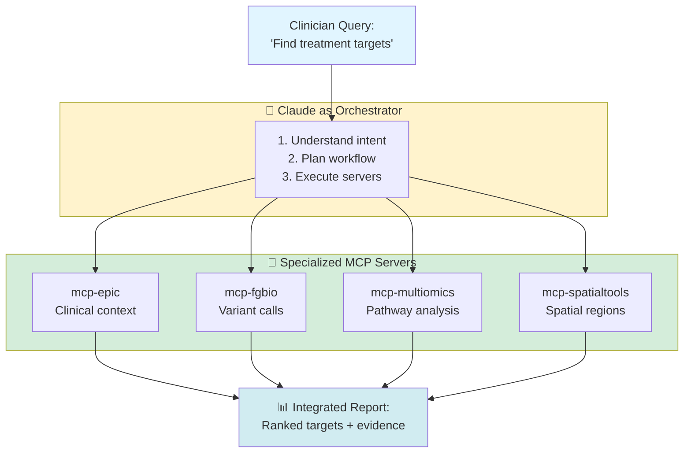
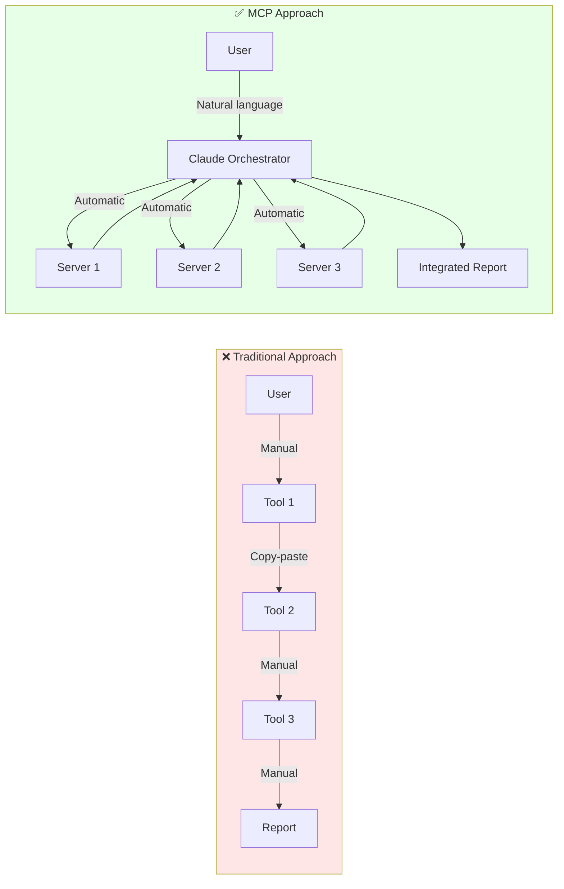

# Why MCP for Healthcare Bioinformatics?

> **Understanding how Model Context Protocol (MCP) transforms precision medicine workflows**


---

## The Orchestration Problem

Traditional bioinformatics requires:
- **Manual data wrangling** between tools (VCF → BED → CSV conversions)
- **Custom scripts** for each integration (Python glue code, shell pipelines)
- **Deep expertise** in multiple domains (genomics, statistics, imaging, clinical data)
- **Significant time** per patient (an estimated 40 hours of manual analysis)
- **Error-prone** copy-paste between tools (Excel → R → Python → clinical report)

**Example Traditional Workflow:**
```bash
# Step 1: Extract clinical data from Epic FHIR (manual API calls)
curl -H "Authorization: Bearer $TOKEN" https://epic.hospital.org/fhir/Patient/123 > patient.json

# Step 2: Download genomic VCF from sequencing core (manual)
scp biocore:/data/patient123.vcf ./

# Step 3: Convert VCF to CSV for analysis (custom script)
python vcf_to_csv.py patient123.vcf > variants.csv

# Step 4: Load into R for pathway analysis (manual)
Rscript pathway_enrichment.R variants.csv > pathways.txt

# Step 5: Combine with spatial data (manual copy-paste)
# ... repeat for imaging, multi-omics, etc.

# Total time: 40+ hours of manual work
```

---

## The MCP Solution

Model Context Protocol enables:

### 1. Natural Language Interface
**Clinicians describe what they need, not how to get it:**

```
User: "Identify actionable drug targets for PatientOne based on
       pathway enrichment across genomic, transcriptomic, and
       spatial data."

Claude: [Automatically orchestrates multiple MCP servers:]
  → mcp-epic: Fetch clinical context
  → mcp-fgbio: Load genomic variants
  → mcp-multiomics: Run pathway enrichment
  → mcp-spatialtools: Analyze spatial regions
  → Integration: Combine results, rank targets

Result: Top 3 targets identified in an estimated 2-5 hours (production) or 25-35 min (DRY_RUN demo)
```

No Python scripts, no manual file conversions, no copy-paste.

### 2. Automatic Orchestration
**Claude coordinates specialized servers automatically:**



### 3. Domain Expertise Encoded
**Each server contains bioinformatics best practices:**

| Server | Encoded Expertise | Replaces |
|--------|-------------------|----------|
| **mcp-fgbio** | Reference genome handling, FASTQ QC, VCF parsing | 5+ custom scripts |
| **mcp-multiomics** | Stouffer meta-analysis, pathway enrichment, DE analysis | R packages + glue code |
| **mcp-spatialtools** | Spatial clustering, Squidpy workflows, region annotation | Python notebooks |
| **mcp-epic** | FHIR queries, clinical timeline extraction | Manual EHR navigation |

**Instead of:** Bioinformatician writes custom integration scripts
**Now:** Domain knowledge lives in the server, accessible via natural language

### 4. Token Efficiency
**Servers return summaries, not raw multi-GB files:**

Traditional approach:
```
User: "Analyze this 4.2 GB VCF file"
System: [Loads entire file into LLM context → exceeds limits]
```

MCP approach:
```
User: "Identify pathogenic variants in patient123.vcf"
mcp-fgbio: [Processes 4.2 GB file server-side]
           [Returns: 23 pathogenic variants (2 KB summary)]
Claude: [Receives concise summary, continues analysis]
```

**Result:** 2,000x reduction in tokens, enabling multi-modal analysis

---

## Architecture Advantage



**Key Differences:**
- **LLM as orchestrator** - Understands intent, plans workflow, coordinates servers
- **Servers as domain experts** - Encapsulate bioinformatics knowledge, return actionable summaries
- **No manual integration** - Claude handles data flow between modalities
- **Reproducible** - Same query → same workflow → consistent results

---

## Real-World Comparison

| Aspect | Manual Approach | Scripted Approach | **MCP Platform** |
|--------|-----------------|-------------------|------------------|
| **Time per patient** | ~40 hours | ~8 hours | **~2-5 hours** (estimated, production) |
| **Expertise required** | PhD-level bioinformatics | MS + coding skills | **Basic training** |
| **Reproducibility** | Low (manual steps) | Medium (version drift) | **High (versioned servers)** |
| **Error rate** | High (copy-paste errors) | Medium (script bugs) | **Low (automated QC)** |
| **Cost per patient** | $3,200 (40 hrs × $80/hr) | $640 (8 hrs × $80/hr) | **Significant reduction** ([Cost Analysis](../shared/cost-analysis.md)) |
| **Accessibility** | Academic centers only | Medium (requires engineers) | **Any hospital** |
| **Multi-modal integration** | Very difficult | Difficult | **Built-in** |
| **Cross-disease portability** | Start from scratch | Rewrite scripts | **Zero code changes** (validated: HGSOC, ER+ BC, preventive CVD) |

---

## Transport: STDIO vs Remote (Streamable HTTP)

**Choosing the right MCP transport for your deployment:**

### STDIO (Local Development)
- ✅ Simple for local development and demos
- ❌ Requires MCP server running on same machine as Claude Desktop
- ❌ Cannot share servers across users
- ❌ Difficult to deploy to cloud infrastructure

### Remote Transport (Recommended for Production)
- ✅ **Servers run on cloud infrastructure** (GCP Cloud Run)
- ✅ **Centralized deployment** - One server instance serves multiple users
- ✅ **HIPAA-compliant** - Data never leaves hospital VPC
- ✅ **Scalable** - Cloud Run auto-scales with demand
- ✅ **Auditable** - All requests logged for compliance
- ✅ **Secure** - Hospital SSO integration, VPC isolation, encrypted transit

**For hospital deployment, remote transport is required for:**
- Centralized data governance (data stays in hospital VPC)
- Audit logging (10-year retention for HIPAA)
- User management (SSO integration)
- Cost efficiency (shared infrastructure)

> **Note:** MCP originally used SSE (Server-Sent Events) for remote transport. The protocol now supports Streamable HTTP as the preferred remote transport. This platform's GCP Cloud Run deployment supports both.

---

## MCP vs Alternatives

### vs RAG (Retrieval-Augmented Generation)
**RAG:** Retrieves documents, passes to LLM
**MCP:** Executes bioinformatics tools, returns summaries

RAG cannot:
- Run Stouffer meta-analysis on proteomics data
- Call FHIR APIs to fetch real-time clinical data
- Execute Squidpy spatial clustering algorithms

### vs Function Calling
**Function Calling:** LLM calls functions defined in prompt
**MCP:** Standardized protocol for tool discovery and execution

MCP advantages:
- **Discoverability** - Servers advertise capabilities automatically
- **Composability** - Mix and match servers without code changes
- **Versioning** - Update server without changing LLM integration
- **Ecosystem** - Share servers across organizations

### vs Custom APIs
**Custom API:** Each tool has unique endpoint/schema
**MCP:** Standardized protocol for all tools

MCP standardizes:
- Tool discovery (`list_tools`)
- Parameter schemas (JSON Schema)
- Error handling (consistent format)
- Authentication (SSE transport handles auth)

---

## Success Metrics

**Validated on synthetic data (3 patients, 3 disease domains):**
- **6 investigational hypotheses** surfaced across HGSOC and ER+ breast cancer that standard workup missed
- **3 preventive health evidence gaps** identified (Lp(a), APOE, CAC) missed by standard lipid panel + population genetic screen
- **Zero disease-specific code changes** between cancer types — same server architecture handles all three
- **Reproducibility:** Consistent results on repeat analysis (canonical fixtures for PAT001 and PAT002)
- **Multi-modal integration:** Genomics, spatial transcriptomics, imaging, clinical, and perturbation data integrated per patient

**Pilot deployment targets (projections pending clinical validation):**
- **Time reduction:** Estimated 40 hours → 2-5 hours production (8-20x faster)
- **Cost savings:** Significant modeled savings per patient ([Value Proposition](../shared/value-proposition.md))
- **Accessibility:** Clinician-operable with basic training (previously required PhD bioinformaticians)

---

## Learn More

- **[MCP Specification](https://modelcontextprotocol.io/)** - Official MCP documentation
- **[Architecture Details](./README.md)** - System design and workflows
- **[Developer Guide](../../for-developers/README.md)** - Build your own MCP servers
- **[Demo & Pitch](../../for-funders/DEMO_AND_PITCH.md)** - See it in action

---

**Last Updated:** 2026-05-09
