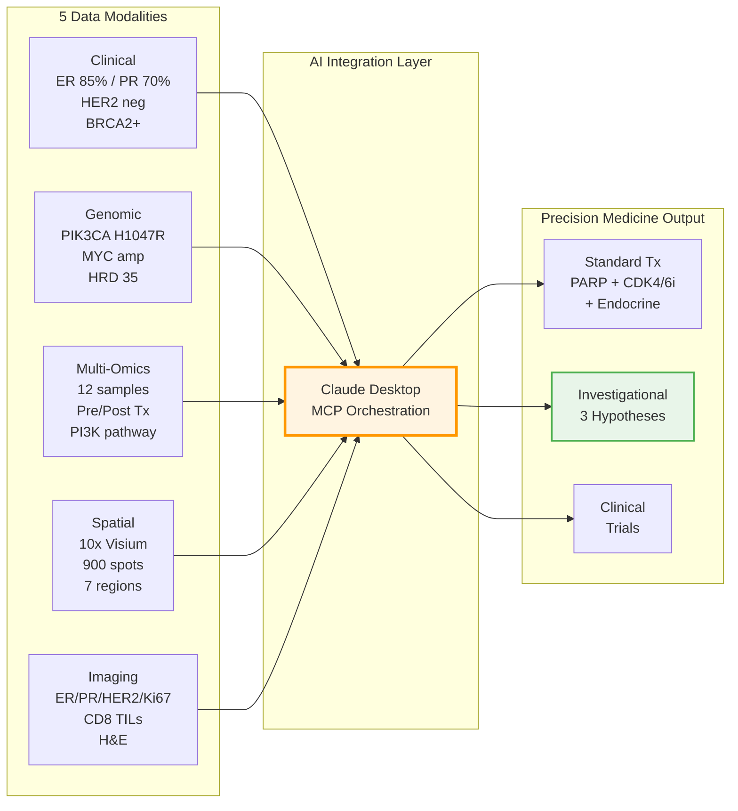

# PatientTwo: Precision Medicine Workflow

Precision medicine workflow for Stage IIA ER+/PR+/HER2- Breast Cancer using all MCP servers.

## Overview

> **Quick references:** [Test Prompts](test-prompts/) | [PAT002 Data](../../../data/patient-data/PAT002-BC-2026/README.md) | [Canonical Values](../../../tests/fixtures/pat002_canonical.py) | [DRY_RUN Mode](../shared/dry-run-mode.md)

PatientTwo demonstrates cross-cancer portability of the platform — the same 19 servers and 127 tools used for HGSOC (PAT001) are applied to a completely different cancer type with **zero disease-specific code changes**.

### Clinical Scenario

**Patient:** Michelle Anne Thompson (synthetic), 42F
**Diagnosis:** Stage IIA (T2N0M0) ER+/PR+/HER2- Invasive Ductal Carcinoma
**Key mutations:** BRCA2 germline c.5946delT + PIK3CA H1047R somatic
**Treatment:** Post-adjuvant AC-T chemo + radiation, currently on tamoxifen
**Status:** Disease-free at surveillance (January 2026)

### Data Modalities



---

## Research Use Only Disclaimer

**CRITICAL:** This workflow is for RESEARCH and EDUCATIONAL purposes only.

- **NOT clinically validated** — Do not use for actual patient care decisions
- **NOT FDA-approved** — Not a medical device or diagnostic tool
- **FOR demonstration** — Shows cross-cancer portability of AI-orchestrated precision medicine

**All data is synthetic.** Any resemblance to actual patients is coincidental.

---

## Key Results

### Standard Treatment Paths (confirmed by platform)

| Treatment | Evidence Source | Server |
|-----------|---------------|--------|
| Olaparib (PARP inhibitor) | BRCA2 germline c.5946delT | mcp-genomic-results |
| Palbociclib (CDK4/6 inhibitor) | ER+/HER2-, standard-of-care | mcp-opentargets |
| Tamoxifen continuation | ER 85%, ESR1 wild-type | mcp-mockepic |

### 3 Investigational Hypotheses (beyond standard workup)

| # | Hypothesis | Rationale | Servers Used |
|---|-----------|-----------|-------------|
| H1 | Inavolisib over alpelisib | PIK3CA H1047R + 2024 FDA approval | opentargets, genomic-results |
| H2 | MYC-driven triple therapy | MYC amplification + CDK4/6i + PI3Ki + endocrine | perturbation, multiomics |
| H3 | YSAPLSSSL vaccine + CAF depletion + anti-PD-1 | Neoepitope on HLA-A\*02:01 + spatial CAF exclusion | neoantigen, quantum, spatialtools |

### Reference Values

See [`tests/fixtures/pat002_canonical.py`](../../../tests/fixtures/pat002_canonical.py) for all validated numbers. Key values:

| Metric | Value | Server |
|--------|-------|--------|
| HRD score | 35 (below myChoice 42) | mcp-genomic-results |
| TMB | 2.8 mut/Mb (low, typical Luminal) | mcp-genomic-results |
| Spatial spots | 900 | mcp-spatialtools |
| Spatial regions | 7 (breast-specific tissue types) | mcp-spatialtools |
| Immune evasion score | 0.41 | mcp-quantum |
| Top neoantigen | YSAPLSSSL (HLA-A\*02:01) | mcp-neoantigen |
| GEARS most actionable | CDK4 | mcp-perturbation |

---

## Test Prompts

See [test-prompts/README.md](test-prompts/README.md) for the complete index.

| Mode | Tests | Purpose |
|------|-------|---------|
| DRY_RUN (10 tests) | Quick validation, no file I/O | CI, demos, exploration |
| SYNTHETIC_DATA (6 tests) | Parses actual generated files | Integration testing, deep-stage validation |

### Running Tests

```bash
# DRY_RUN mode (default, instant)
# Paste any DRY_RUN test prompt into Claude Desktop — all servers start with *_DRY_RUN=true

# SYNTHETIC_DATA mode
# Set *_DRY_RUN=false in claude_desktop_config.json, then paste SYNTHETIC_DATA prompts
# Data files required at: data/patient-data/PAT002-BC-2026/
```

---

## What Makes PatientTwo Unique

1. **Cross-cancer validation** — Proves the same platform handles both HGSOC and ER+ breast cancer
2. **Zero code changes** — No disease-specific server modifications needed
3. **Deep-stage results** — Stages 3-4 (target profiling + causal inference) surface investigational hypotheses unreachable by standard oncology workup
4. **HLA typing integration** — PAT002 includes pre-computed HLA typing, enabling neoantigen vaccine candidate prioritization
5. **Goal-oriented testing** — test-7-e2e-goal-oriented trusts model routing rather than prescribing tool sequence

---

**Status:** 100% Synthetic — Research/Demo Only
