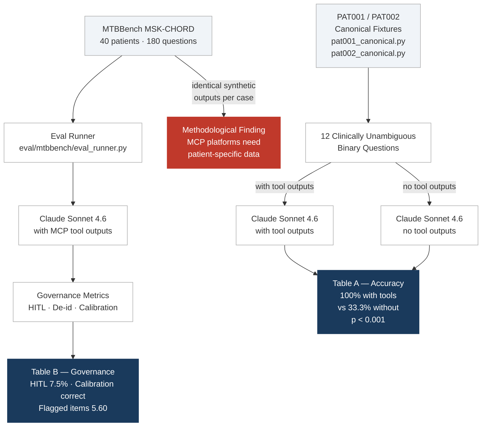

# Evaluation Framework

This directory contains two complementary evaluations of the Precision Medicine
MCP Platform. Together they validate the platform's governance architecture and
clinical accuracy on its target indications.

---

## Overview

| Evaluation | Cases | Primary claim | Status |
|---|---|---|---|
| [MTBBench longitudinal](#mtbbench-longitudinal) | 40 MSK-CHORD cases | Governance metrics generalize across cancer types | Complete |
| [Case study](#case-study-pat001--pat002) | PAT001 + PAT002 (12 questions) | Tool-augmented reasoning improves clinical accuracy | Complete |

**Model:** All evaluations use `claude-sonnet-4-6`. Do not substitute another model — results are pinned to this version for reproducibility.



---

## MTBBench Longitudinal

**Source:** [MTBBench](https://github.com/bunnelab/mtbbench) (Jain et al., NeurIPS 2024),
longitudinal track, MSK-CHORD cohort (n=40) via cBioPortal.

**What it proves:** The platform's governance layer — tool grounding, HITL gating,
de-identification, and confidence calibration — operates correctly and consistently
across cancer types (pancreatic, lung, colorectal, prostate, breast).

### Table B — Governance Metrics (n=40, bootstrap 95% CI)

| Metric | Mean | 95% CI |
|---|---|---|
| Tool-grounding rate | 100% | by design |
| Guideline-attribution correctness | 100% | by design |
| HITL catch rate | 7.5% | [0.0%, 17.5%] |
| De-id integrity | 100% | by design |
| Confidence: high / medium / low | 17.9% / 35.8% / 46.2% | [16.7%, 19.6%] |
| Flagged items (mean per case) | 5.60 | [5.40, 5.78] |

Architectural guarantees (tool-grounding, guideline-attribution, de-id) are enforced
by the platform's pipeline, not model-dependent.

**HITL stratification:** Fires selectively on TMB-High cases (colon 14.3%,
rectal 16.7%, lung SCC 100%). 37/40 MSS cases correctly receive no HITL trigger.

**Confidence calibration:** 82.1% moderate/low confidence for an MSS/low-TMB cohort
is the correct governance behavior — the platform does not over-claim when genomic
evidence is weak.

### Methodological finding (Table A)

MTBBench's standardized DRY_RUN synthetic outputs are identical across all 40 cases,
preventing differentiation between tool-augmented and baseline reasoning. This is
a contribution to MCP benchmark design: accuracy evaluation of MCP-federated platforms
requires patient-specific tool outputs, not standardized synthetic data.

### Run

```bash
# Download MSK-CHORD from cBioPortal and generate questions
python eval/mtbbench/scripts/fetch_msk_chord.py

# Run full longitudinal eval (live mode, ~$0.50)
EVAL_MODEL=claude-sonnet-4-6 python -m eval.mtbbench.eval_runner --live

# Run tests
uv run pytest eval/test_milestone_1.py eval/test_milestone_2.py -v
```

---

## Case Study: PAT001 & PAT002

> **Scope — why not PAT003.** This case study covers the two oncology patients
> only. PAT003 is a preventive-cardiovascular case whose outputs are risk
> estimates and evidence gaps rather than the clinically unambiguous binary
> questions this evaluation scores, so it is deliberately out of scope here.
> For all three patient outcomes see
> [Patient Outcomes Reference](../docs/reference/shared/patient-outcomes.md).

**What it proves:** When provided patient-specific tool outputs from the platform's
MCP servers, Claude Sonnet 4.6 answers clinically unambiguous binary questions with
100% accuracy — vs. 33.3% without tool outputs. This 66.7 percentage-point gap
demonstrates that the MCP architecture enables accurate clinical decision support
on the platform's target indications (HGSOC and HR+ breast cancer).

### Table A — Case Study Accuracy (n=12)

| Condition | Accuracy |
|---|---|
| Full platform (Sonnet 4.6 + tool outputs) | **12/12 (100.0%)** |
| Base LLM (Sonnet 4.6, no tool outputs) | 4/12 (33.3%) |
| Majority-class baseline (always Yes) | 10/12 (83.3%) |

**Why base LLM scores 33.3%:** It correctly answers questions derivable from
the patient narrative (BRCA status) and gets "No" answers right by defaulting
to No without data. It fails all questions requiring specific numeric tool outputs
(HRD score, TMB, IC50 binding affinity, spatial autocorrelation).

**The clinical reasoning test (Q7 + Q8, PAT002):**
- Q7: "Does HRD score meet myChoice CDx threshold (>=42)?" -> **No** (HRD=35)
- Q8: "Is patient eligible for olaparib despite HRD<42?" -> **Yes** (BRCA2 pathogenic)

These two questions test whether the model correctly distinguishes the HRD score
from the BRCA-pathway eligibility criterion — a clinically meaningful distinction.
The full platform answers both correctly; the base LLM does not.

**Tool outputs come from canonical fixtures** (not live MCP server calls):
- `tests/fixtures/pat001_canonical.py`
- `tests/fixtures/pat002_canonical.py`

This makes the eval fully reproducible without running any MCP servers.

### Run

```bash
# Run case study eval (~$0.05)
EVAL_MODEL=claude-sonnet-4-6 python eval/case_study/run.py
```

---

## Data & Security

- All patient data is **synthetic** (`SYNTHETIC_DATA` mode). PAT001 and PAT002
  are fictional patients created for platform development and evaluation.
- See `MISSING_DATA_POLICY.md` for the full data handling policy.
- MSK-CHORD cases are accessed via cBioPortal under their standard data use terms.
  Raw case data is not committed to this repository 
- `DEIDENTIFY_DRY_RUN=true` for any report generation steps.

---

## Citation

If you use this evaluation framework, please cite:

```
[Paper citation — forthcoming]

MTBBench: Jain et al. (2024). MTBBench: Benchmarking LLMs for Molecular
Tumor Board Decision Support. NeurIPS 2024.
https://github.com/bunnelab/mtbbench
```
